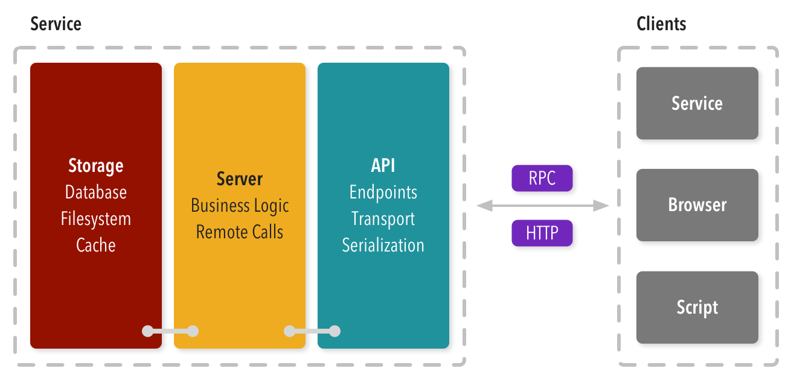

# Harvest Platform

## Architecture

The Harvest Platform has been designed using the _microservice_ architecture. The purpose of this is promote decoupling of service responsibilities, enforce the [bounded context](http://martinfowler.com/bliki/BoundedContext.html) through service boundaries, and make it simpler to extend and evolve the platform over time.

At a architectural level, the fundamental unit is a service. A service is composed of up to three logical layers depending on the requirements of the service.

The **API** layer exposes an interface for clients to interact with. The role of the API component is translate a request/message into a native format so the server can handle it. Likewise once the server has handled the request, the API may need to respond the client to return data or acknowledged that the request has been handled.

Implementing the API layer requires selecting the set of protocols necessary to satisfy the expectations of the client. These typically include [HTTP](https://en.wikipedia.org/wiki/Hypertext_Transfer_Protocol), [JSON+RPC](http://json-rpc.org/), [gRPC](http://grpc.io/), or other custom ones. Second, a protocol must choose the set of transport mechanisms that are necessary such as HTTP, [0MQ](http://zeromq.org/), or raw TCP. The final decision is choice of serialization formats to support for messages such as [JSON](http://json.org/), [MessagePack](http://msgpack.org/), and [Protocol Buffers](https://developers.google.com/protocol-buffers/).

In practice, the protocols, transports, and serialization formats are standardized across services so these decisions do not need to be made each time a new service is being developed.

The **Server** layer contains the business logic of the service. It defines a standard interface that API layer can interact with. If the server needs to communicate with other services in system, it will need to perform _remote procedure calls_.

The **Storage** layer exposes an interface for the Server layer to use in order to store local state or persist application data. As with the other two layers, it must provide an interface that the Server components can use without exposing implementation details of the storage backend.

Note that not all layers are required. In fact there are few general types that may exist in a system depending on the responsibility of the service.

The most common one is a service that provides an API, does some bit of computation and responds. For example, a web server that serves static files, a proxy, etc. It does not have any local state that needs to be stored nor does it handle application data.

The second most common one is the one shown above that also includes some bit of storage for storing local state or application data.

The last two apply to a different use case. Notice that the API layer is not present. This is common for _background_ services that pull work off of a queue or subscribe themselves to a pub/sub broker. In any case there is not a public API since it only receives work through this asynchronous means.

The below variant shows this asynchronous service but with reliance on storage.

